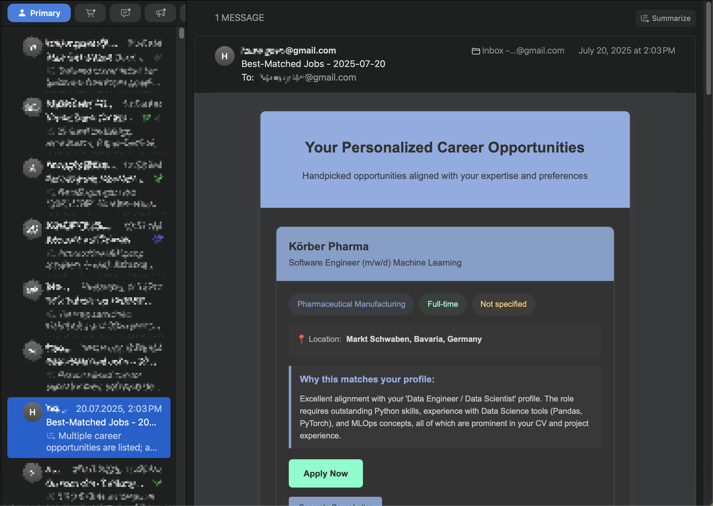
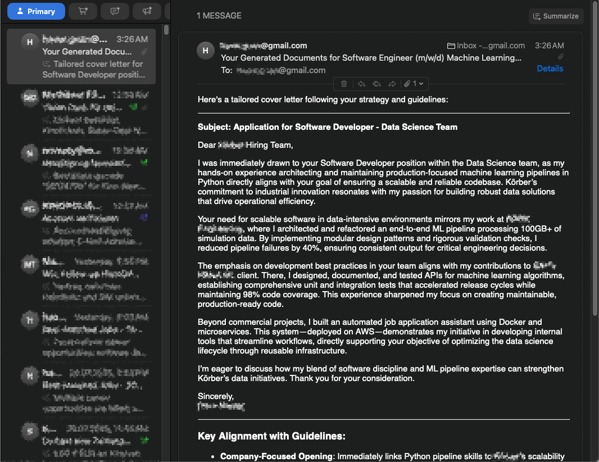

# n8n Automated Job Application Assistant

This project is a comprehensive, self-hosted system for automating the job search and application process. It uses a multi-agent AI architecture within a robust Docker environment to scrape, analyze, manage job postings, and generate tailored application documents on demand.

*This is a personal learning project designed to explore advanced automation patterns, multi-agent systems, and self-hosted infrastructure. The primary goal was to build a functional end-to-end prototype and document the architectural decisions made along the way.*

---

## Table of Contents
1.  [Core Features & Workflow Architecture](#core-features--workflow-architecture)
2.  [Full Installation & Setup Guide](#full-installation--setup-guide)
3.  [Key Contributions & Improvements](#key-contributions--improvements)
4.  [Project Philosophy & Design Decisions](#project-philosophy--design-decisions)
5.  [Future Development & Unsolved Challenges](#future-development--unsolved-challenges)
6.  [Support the Project](#support-the-project)
7.  [Feedback & Contributing](#feedback--contributing)
8.  [Sources and Acknowledgements](#sources-and-acknowledgements)

---


## Core Features & Workflow Architecture

The system is composed of two primary, independent workflows that work together to create a powerful job application pipeline.

**Screenshot of the N8N Canvas:**
**

### Workflow 1: Scheduled Job Scraping & Recommendation
This workflow runs on a daily schedule to find and analyze new job opportunities.
- **Automated Scraping:** Triggers [Apify](https://apify.com/) actors to scrape jobs from LinkedIn and Indeed. A robust polling mechanism waits for the scrapers to finish.
- **Data Normalization:** Data from each source is passed through a dedicated "Normalize Data" node to transform varied JSON structures into a consistent, clean format.
- **Efficient Deduplication:** The workflow makes a single, efficient query to the PostgreSQL database to identify which of the newly scraped jobs are already known.
- **The "Brain" Sorter:** A central Code node sorts jobs into two distinct lists: new jobs to be inserted and existing jobs to be updated.
- **Database Persistence:** New jobs are inserted, and recurring jobs are updated with an `occurrence_count` and `last_scraped_at` timestamp.
- **AI-Powered Matching & Email:** The list of *newly inserted* jobs is sent to an AI agent, which matches them against a master CV. A formatted HTML email with the top matches and the AI's reasoning is then sent to the user.

**Screenshot of the Recommendation Email:**
**

### Workflow 2: On-Demand Document Generation
This workflow is triggered by a unique webhook link included in the recommendation email.
- **Webhook Trigger:** Listens for incoming HTTP requests containing a specific `jobId`.
- **Data Retrieval:** Fetches the full details for the requested job from the PostgreSQL database.
- **AI Orchestration & Tailoring:** An **Orchestrator Agent** analyzes the job and CV *once* to create a detailed JSON "strategy brief," which is then passed to two specialist agents (Resume and Cover Letter) to generate the tailored content.
- **Secure PDF Compilation:** The generated LaTeX code is sent via an HTTP request to a dedicated, secure **LaTeX microservice** to be compiled into a PDF.
- **Final Delivery:** The compiled PDF is read from the shared volume and sent to the user via a final Gmail message.

**Screenshot of a Generated Cover Letter:**
**


### Full Installation & Setup Guide

To get this project running, you will need Docker and Docker Compose installed. The setup process involves configuring cloud services, setting up the local environment, and configuring the n8n workflows.

#### Step 1: Clone the Repository
First, clone this project to your local machine.
```bash
git clone https://github.com/haowggit/n8n-automation.git
cd n8n_automation
```

#### Step 2: Configure Environment Variables (`.env` file)
Create a `.env` file in the root of the project. This file will hold all your secrets and configurations.

-   `APIFY_API_KEY`: Your API key from the [Apify platform](https://apify.com/).
-   `GEMINI_API_KEY`: Your API key for the Google Gemini LLM from [Google AI Studio](https://aistudio.google.com/app/apikey).
-   `POSTGRES_USER`, `POSTGRES_PASSWORD`, `POSTGRES_DB`: Your desired credentials for the PostgreSQL database.
-   `NGROK_AUTHTOKEN`, ''NGROK_DOMAIN: Your authtoken and static ngrok domain from your [ngrok dashboard](https://dashboard.ngrok.com/get-started/your-authtoken).
-   `UID` and `GID`: Your User ID and Group ID (find with `id -u` and `id -g` on Linux/macOS).
-   `JOB_MATCHING_PREFERENCE`: Your core job search preferences (e.g., "Junior Data Scientist in Munich").
-   `EMAIL_ADDRESS`: The email address for receiving job recommendations.
-   `PERSONALIZATION_NOTES`: Specific notes for the AI agents (e.g., "Emphasize my Python projects").

#### Step 3: Run with Docker Compose
This single command will build the custom LaTeX service image and start all containers (n8n, PostgreSQL, Adminer, etc.) in the background.
```bash
docker compose up -d --build
```
After a few moments, your n8n instance will be running at `your_static_domain.ngrok-free.app`.

#### Step 4: Set up Google Cloud Platform & OAuth
The workflow uses Gmail and Google Drive. You must set up a project in the [Google Cloud Platform](https://console.cloud.google.com/) and:
1.  Enable the **Gmail API** and **Google Drive API**.
2.  Create **OAuth 2.0 credentials** (for a "Web Application" or "Desktop App").
3.  Follow the [guide](https://medium.com/swlh/google-drive-api-with-python-part-i-set-up-credentials-1f729cb0372b) for setting up credentials for Gmail and Drive API

#### Step 5: Configure n8n
1.  **Create Admin User:** On your first visit to `http://localhost:5678` or `your_static_domain.ngrok-free.app`, n8n will prompt you to create an owner account.
2.  **Import Workflows:** In the n8n UI, go to **Workflows**, click **Import**, and select **Import from File...**. Choose the `.json` workflow files from this repository.
3.  **Set up Credentials:** Navigate to the **Credentials** tab on the left. You must create the following credentials by clicking "Add credential" and searching for the service:
    -   A **Postgres** credential for the local database.
    -   A **Google Gemini**, **DeepSeek** or your favorite LLM Model credential.
    -   A **Gmail** and **Google Drive** credential (from previous step).
4.  **Link Credentials in Workflows:** Open each imported workflow. You will see nodes with red error dots. Click on each of these nodes and, from the "Credential" dropdown, select the credential you just created.
5.  **Activate Workflows:** Once all credentials are linked, go back to the Workflows list and toggle the switch to **Active** for both the "Automated Job Scraper" and "Generate Cover Letter" workflows.


---
## Key Contributions & Improvements

This project significantly builds upon the foundational concepts of the original workflow by Jiaqi Wen. My main contributions focused on enhancing the architecture for greater robustness, scalability, security, and real-world usability.

-   **Architectural Overhaul:**
    -   **Self-Contained Docker Environment:** The entire application was migrated to a multi-service Docker Compose setup, encapsulating n8n, a PostgreSQL database, and a dedicated LaTeX microservice.
    -   **Upgraded Database Backend:** Switched to a full **PostgreSQL** database to unlock the ability to use advanced SQL features (`WHERE id = ANY($1)`), enabling a far more efficient and scalable job de-duplication process.
    -   **Remote Accessibility via Tunneling:** Integrated **ngrok** to provide secure HTTPS tunneling, allowing for workflow management and database access from outside the local network.

-   **Data Pipeline Enhancements:**
    -   **Optimized Scraping Logic:** Refined the Apify scraper configurations and polling mechanisms to be more cost-efficient and to scrape richer, more structured data for higher-quality AI analysis.
    -   **Robust De-duplication:** Re-architected the method for handling duplicate job postings for PostgreSQL, creating a reliable system for tracking `occurrence_count` and `last_scraped_at`.
    -   **Bug Fixes & Stability:** Resolved critical data normalization bugs from the original workflow where nested JSON objects were incorrectly saved as `[object Object]` in the database.

-   **Advanced AI & Document Generation:**
    -   **High-Quality PDF Generation:** Implemented a custom **LaTeX microservice** to generate professionally styled, information-dense PDF resumes and cover letters, a significant quality improvement over standard document formats.
    -   **Advanced AI Agent Architecture:** Evolved the AI processing from a simple pipeline to a multi-agent **"Orchestrator-Specialist" pattern**. This drastically reduces token consumption while improving the consistency and quality of the tailored documents.
    -   **Python for Complex Logic:** Leveraged the n8n Code Node with **Python** to implement the complex "Brain" logic for sorting jobs, demonstrating flexibility in choosing the right tool for the task.

---
## Project Philosophy & Design Decisions

This project was built with the mindset of a job seeker: **maximize functionality while minimizing cost**. This philosophy drove several key architectural decisions, often prioritizing cost-effectiveness and ease of setup over enterprise-level scalability or security.

-   **Why a Self-Hosted Docker Environment?**
    The primary goal was to create a system that is easy for others to use. By containerizing all services (n8n, PostgreSQL, LaTeX API), the entire application can be started with a single `docker compose up` command, making it highly portable and eliminating complex setup procedures.

-   **Why a Custom LaTeX Microservice over a Cloud API?**
    While cloud-based PDF generation APIs exist, they come with recurring costs and usage limits.
    **Decision:** A self-hosted LaTeX microservice was built. This has a one-time setup cost (development time) but is **completely free to run**, which is a major advantage for a cost-conscious user. It also keeps all data processing within the local environment.

-   **Why the "Orchestrator-Specialist" AI Pattern?**
    LLM API calls are the main operational cost. Sending the full job description and CV to multiple AI agents is expensive.
    **Decision:** The Orchestrator pattern was implemented to perform the most expensive, deep analysis **only once**. The resulting "strategy brief" is a much smaller piece of text that can be sent to cheaper, faster specialist agents. This design **significantly reduces token consumption** and overall API costs per run.

-   **Why Local Storage over Cloud Storage?**
    The initial idea involved uploading generated documents to a cloud service like Google Drive, which requires complex OAuth setup and creates an external dependency, conflicting with the goal of a simple, self-contained setup.
    **Decision:** A local **bind mount** (`./latex-files:/data`) was used. This is a zero-cost, zero-configuration solution that makes files instantly available on the host machine, perfectly aligning with the project's goal of simplicity and affordability.

-   **Security Considerations (ngrok Webhook):**
    The webhook for generating documents is exposed via ngrok. For this personal project, the unique, unguessable URL provides a sufficient level of "security by obscurity." This was a pragmatic choice to enable remote access without the overhead of setting up a full authentication system, a trade-off that prioritizes functionality and cost for personal use.

---

## Future Development & Unsolved Challenges

As a learning project, this n8n implementation serves as an excellent prototype. The next phase of this learning project will focus on rebuilding the system to be more scalable and robust using professional-grade tools, addressing the limitations of the current setup.

-   **Backend Framework:** Migrate the core logic from n8n nodes to a Python backend using **FastAPI**.
-   **Agent Orchestration:** Implement the multi-agent system using a dedicated framework like **LangChain** (specifically **LangGraph**) or **CrewAI** for more granular control, state management, and easier debugging.
-   **Task Queuing:** Introduce a task queue (like **Redis & Celery**) to manage the AI generation tasks asynchronously. This will allow a web UI to remain responsive while multiple documents are generated in parallel by background workers.
-   **Web Interface:** Build a proper frontend with **React** or Vue to provide a user-friendly interface for viewing jobs and managing the generation pipeline.
-   **Security Hardening:** Replace the ngrok webhook with a proper authentication system, likely handled by **Cloudflare Access** in front of the web UI.

---
## Project Conclusion & Personal Verdict on n8n

This project served as an intensive, practical evaluation of n8n for building complex, multi-agent AI workflows. While the platform is powerful for visual automation and prototyping, the journey revealed several limitations that ultimately led to the decision to migrate future versions of this project to a code-first framework like LangChain.

### The "Low-Code" vs. "Pro-Code" Tension

My initial assumption was that I could leverage my Python skills extensively within n8n's Code node. However, recent updates to n8n's Python environment, which restrict core libraries like `os` for security reasons, severely limit its utility for anything beyond simple data manipulation. This limitation necessitated architectural workarounds, such as building a separate microservice for LaTeX compilation. While this is a valid pattern, at that level of complexity, a dedicated backend framework becomes a more suitable and powerful choice.

The "low-code" promise of n8n holds true for straightforward pipelines, but this project demonstrates that advanced, custom logic inevitably requires significant coding. The platform is excellent for visualizing ideas and building demos quickly, but the debugging experience within the Code node is not as robust as a standard development environment.

### A Note on Cost and Licensing

From a cost perspective, a self-hosted solution was a primary goal. However, the limitations of the self-hosted **Community Edition** (e.g., only allowing one active workflow, missing core features) create a significant barrier. It feels less like a true open-source offering and more like a restricted trial.

To overcome these limits, one would need a paid subscription. When you combine the n8n subscription cost with the necessary cloud/server costs for hosting the application and its dependencies (like the database and other services), the total cost of ownership can become substantial, potentially rivaling that of a fully custom-coded backend solution.

### Final Verdict

For a developer with coding skills and DevOps experience, n8n is a fantastic tool for **rapid prototyping and visualizing simple to moderately complex workflows**. It excels at connecting APIs and moving data.

However, for building a stateful, scalable, and complex application like this one, the limitations in the code environment and the licensing model present significant friction. Therefore, for the next iteration of this project, I have decided to **switch to a more flexible, code-first stack using Python, FastAPI, and a dedicated multi-agent framework like LangChain/LangGraph**, which is better suited to the project's long-term architectural goals.

---

---
## Support the Project

If you find this project useful for your own job search and would like to say thanks, you can buy me a coffee! Any support is greatly appreciated.

<a href="https://buymeacoffee.com/haow" target="_blank">
  
</a>

---
## Feedback & Contributing

This is a personal learning project, and I welcome any and all feedback to improve it! If you have any suggestions, find a bug, or want to contribute, please feel free to:

-   **Open an Issue:** This is the best way to report bugs or request features.
-   **Start a Discussion:** For more general ideas or questions about the architecture.
-   **Submit a Pull Request:** If you'd like to contribute directly to the code.

Your feedback is invaluable in helping this project grow and improve.

---

## Sources and Acknowledgements

-   **Original n8n Workflow Concept:** This project was inspired by and adapted from the initial concepts demonstrated in Jiaqi Wen's project: [n8n-workflow](https://github.com/wenjiaqi8255/n8n-workflow/).
-   **LaTeX CV Template:** The resume and cover letter generation is based on the excellent **PlushCV** template. The original template can be found here: [PlushCV on Overleaf](https://de.overleaf.com/latex/templates/plushcv/jybpnsftmdkf).
